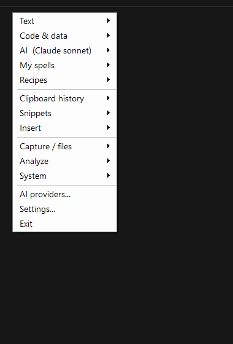
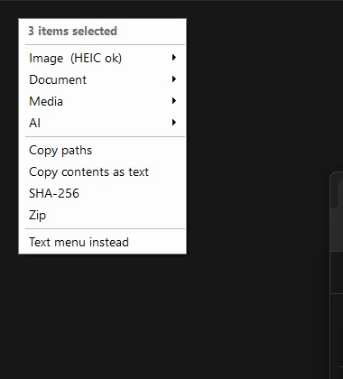

# Grimoire

**Cast transforms on highlighted text — or on files — anywhere on Windows.** This is the public source for the Windows app, maintained by [lodestoner](https://github.com/lodestoner). Version `2.2.0-rc.1` is a development candidate. There is no public binary release yet.

Highlight text in any app, **Ctrl + right-click** (or **Alt + right-click**), and pick a spell: clean it up, change case, fix typography, encode/hash/format it, or hand it to an AI (fix grammar, tighten, rewrite, summarize, translate…). Select files in Explorer and do the same for conversions: HEIC → JPG, DOCX → Markdown, PDF → text, video → GIF. Chain spells into **recipes**, write your own **custom spells**, keep a **house style**, or run **metric-targeted rewrite loops** until copy hits a reading grade or word count.

One standalone `Grimoire.exe`. No runtime to install, no AutoHotkey, no PowerToys. AI can use Claude Code sign-in, your own API key, or an OpenAI-compatible server. Codex and Gemini CLI actions are temporarily disabled pending selected-input isolation.

> Why "Grimoire"? It's a book of spells. The menu is your spellbook, recipes are spells you write, the style profiles are your house magic, and the AI is the power behind it.

---



## Build from source

On Windows x64, install the exact [.NET SDK in `global.json`](global.json) (10.0.401), Python 3 and Inno Setup 6. CI uses Inno Setup 6.7.1. From a clean checkout:

```powershell
dotnet restore app/Grimoire/Grimoire.csproj --locked-mode
dotnet restore tests/Grimoire.Tests/Grimoire.Tests.csproj --locked-mode
dotnet build app/Grimoire/Grimoire.csproj -c Release --no-restore
dotnet build tests/Grimoire.Tests/Grimoire.Tests.csproj -c Release --no-restore
dotnet run --project tests/Grimoire.Tests/Grimoire.Tests.csproj -c Release --no-build -- --report test-results/windows-regression.txt
python -m unittest discover -s tests/privacy-audit
python scripts/audit-privacy.py
.\build.ps1
```

`build.ps1` prepares an unsigned, local installer and portable packages under `dist/candidate`; it does not publish them. `-SkipInstaller` prepares portable packages without Inno Setup. The [Build workflow](https://github.com/lodestoner/grimoire/actions/workflows/build.yml) runs disposable Windows install tests and uploads text evidence only. It does not offer downloadable binaries. See [source and verification status](docs/PUBLIC-SOURCE-STATUS.md) before using a local build.

## First run

Run your local build. Local tools work without an AI account. The optional setup window lets you configure a provider:

- **Claude** — install Claude Code, click **Sign in**, finish in the browser. Uses your Claude subscription, no key.
- **ChatGPT/Codex CLI and Gemini CLI** — actions are temporarily unavailable while their selected-input isolation is verified. Saved choices remain, but choose another provider explicitly for now.
- **API key** — Anthropic, OpenAI, or Gemini: **Get key** opens the vendor page, **Set key** stores it in Windows Credential Manager.
- **Compatible server** — point at a local Ollama or LM Studio instance, or a hosted OpenAI-compatible endpoint such as OpenRouter.

Choose which provider handles quick edits, precise polish and vision, then select **Test**. The **Starter spells** gallery follows; tick a few prompts to seed your menu.

Tray icon → **Install "Send to" shortcut** to hand files over from an Explorer right-click. **View releases…** opens the repository's releases page, which may be empty. Automatic update checks and executable replacement are unavailable.

## Using it
- **Text:** highlight, Ctrl/Alt + right-click, pick an action. In-place edits are undoable (Ctrl+Z). AI edits open a review window first so you can eyeball them.
- **Files:** select in Explorer and Ctrl/Alt + right-click, or Send to → Grimoire, or drop onto the drop zone. Outputs land next to the source with a new extension.
- **Keyboard:** `Ctrl+Alt+F` menu · `Ctrl+Alt+U/L/T/S` case · `Ctrl+Alt+J` join · `Ctrl+Alt+W` clean · `Ctrl+Alt+G` fix grammar · `Ctrl+Alt+P` polish · `Ctrl+Alt+C` custom prompt. `Ctrl+Shift+V` paste-as-plain is off by default (terminals use it).
- Tray → **Pause hotkeys** when a game needs the clicks.

### Text menu
| Section | What |
|---|---|
| Text | UPPER/lower/Title/Sentence/AP headline/camel/snake/kebab/CONSTANT/slug · join/clean/split/collapse/sort/unique/reverse/trim/number · curly/straight quotes, em dash, ellipsis, de-accent · paste as plain text |
| Code & data | base64, URL, HTML entities · JSON pretty/minify/escape · MD5, SHA-256 · code fence · audit code/string |
| AI | fix grammar · polish (precise) · tighten · clarity · headline · headline ideas · summarize · bullets · explain · find bugs · add comments · translate · custom prompt · apply house style · rewrite to reading grade · trim to word count |
| My spells | your `spells.ini` |
| Recipes | chains of transforms, AI steps, or spells |
| Clipboard history / Snippets | last 30 copies · saved blocks |
| Insert | dates, timestamp, UUID, lorem |
| Capture / files | capture to notes folder · screen snip → OCR / describe / reproduce as HTML / save PNG · page source · route last download · reminders · drop zone |
| Analyze | word count, readability, web search |

### File menu
| Kind | Actions |
|---|---|
| Images | to JPG/PNG/BMP/TIFF/GIF (HEIC, WebP in) · resize · compress to ~500/200 KB · strip EXIF/GPS · describe / OCR with AI |
| Documents | DOCX → Markdown/Text · PDF → Text · Markdown → HTML/DOCX · CSV ↔ JSON · JSON ↔ YAML · line endings |
| Media | video → GIF · extract MP3 · compress · to MP4 · first frame · trim · audio → MP3/WAV (ffmpeg; one-click install) |
| AI | summarize, explain, action items, ask a question about txt/md/csv/json/docx/pdf |
| Any | copy paths, copy contents, SHA-256, zip, your file spells, send to Paperless |



Headless: `Grimoire.exe --convert jpg|png|small|strip|md|txt|html|docx|json|csv|yaml|gif|mp3|compress <files...>`

## Custom spells
**My spells → New spell…** opens one editor for all three kinds, with a **Test** button that runs the spell on sample text before you save:

- **AI prompt** — an instruction; choose whether the result replaces the selection, opens for review, or just shows.
- **Shell command** — any command line; the selected text arrives on stdin and in `%SPELL_TEXT%`.
- **HTTP call** — URL, method, headers, body with `{text}` / `{json}` / `{file}` placeholders. Webhooks, Obsidian, Slack, Home Assistant, anything with a URL.

Tick **File spell** to put it in the file menu instead (`{file}` is the path, one run per selected file). **My spells → Starter spells…** reopens the gallery.

The same spells live in `spells.ini` if you prefer a text editor:
```ini
[Explain like I'm 8]
type=prompt
prompt=Explain this for a curious 8-year-old in three short sentences. Output only the explanation.
mode=show            ; replace | show | review
style=none           ; none | auto | prose | code
role=quick           ; quick | precise

[Send to webhook]
type=http
url=https://example.com/hook
headers=Content-Type: application/json
body={"text": {json}}

[Word frequency]
type=command
command=pwsh -NoProfile -Command "$input | ..."
mode=show
```
`files=1` puts a spell in the file menu (`{file}` placeholder, one run per file). Prompt spells also have an in-app editor.

## Recipes (`recipes.ini`)
```ini
[Polish prose]
steps=clean,grammar,curly,emdash
```
Steps are any transform key, an AI step (`grammar`, `tighten`, `clarity`, `headline`, `housestyle`), or the name of a spell.

## Integrations
Settings → Integrations: **ntfy** (phone push and server-scheduled reminders), **Paperless-ngx** (upload files or captures), **SSH hosts** (run a command across machines). Tokens go to Credential Manager. Anything else is a `type=http` spell.

## Privacy and network access
Local text transforms and file conversions run on your computer. Grimoire has no telemetry, and clipboard history is kept only in memory until the app exits or you clear it.

This source candidate makes no automatic update requests and never downloads or installs an update. The historical update preference remains saved but disabled in the UI. Network access happens through features you choose: AI providers, page-source/web-search actions, HTTP spells, and configured ntfy or Paperless integrations. AI prompts can include selected text, files, images and a style profile. SSH and shell-command spells run under your Windows account and can reach other systems. Integration URLs and role choices are stored in the settings INI; API and integration tokens entered in Grimoire are stored in Windows Credential Manager. Custom HTTP-spell headers are stored as plain text in `spells.ini`, so do not put credentials there.

Vendor CLI integrations can act on model instructions in selected content. Codex and Gemini CLI actions are temporarily disabled because their adapters have not established a boundary that limits file reads to selected input. Saved settings are retained, and no other provider is chosen automatically. API adapters do not expose local agent tools. Authenticated remote integrations can be configured with plain HTTP, and some file conversions have no application size limit. These and other [known security limits](SECURITY.md) remain binary-release work.

Diagnostics stay in `grimoire.log` in the data folder. They record timestamps, action categories, character counts and window handles. The error logger records allowlisted categories, exception types and numeric codes rather than exception messages. Review logs before sharing them. See [the privacy audit](docs/PRIVACY-AUDIT.md) for limits.

Build details: [RELEASING.md](RELEASING.md). Contributions: [CONTRIBUTING.md](CONTRIBUTING.md). Changes: [CHANGELOG.md](CHANGELOG.md).
Diagnostics: `grimoire.log` in the data folder; `GRIMOIRE_TRACE=1` logs hook events; `--test-chord U`, `--test-click`, `--test-inject` exercise the real input path.

## License
MIT — see [LICENSE](LICENSE).
